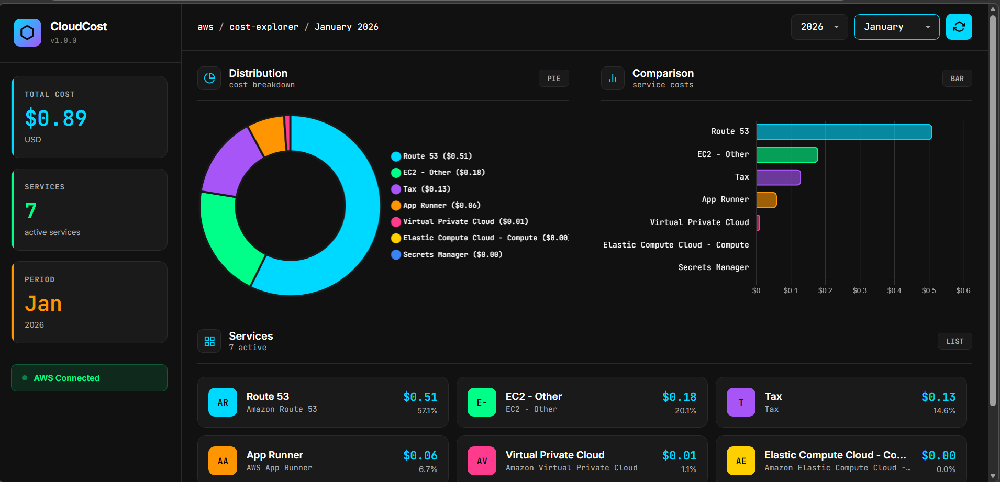

# CloudCost

A Spring Boot application for monitoring AWS cloud costs using the Cost Explorer API. This tool fetches, stores, and analyzes AWS billing data, providing REST APIs for cost visualization and budget alerts.



## Features

- **Daily Cost Fetching**: Automatically fetches AWS cost data daily via scheduled jobs
- **Cost Analytics**: Monthly summaries and service-level trend analysis
- **Budget Alerts**: Email notifications when costs exceed configured thresholds
- **REST API**: Full API for cost data access and management
- **Local Storage**: H2 database in file mode for data persistence
- **Docker Ready**: Multi-stage Dockerfile for containerized deployment

## Prerequisites

- **Java 21** or higher
- **Maven 3.8+** (or use the included Maven wrapper)
- **AWS Account** with Cost Explorer enabled
- **AWS Credentials** configured locally

## Quick Start

### 1. Clone and Build

```bash
git clone <repository-url>
cd cloud-cost-monitor

# Build the project
./mvnw clean package

# Or on Windows
mvnw.cmd clean package
```

### 2. Configure AWS Credentials

The application uses the AWS Default Credential Provider Chain. Configure your credentials using one of these methods:

**Option A: Environment Variables**
```bash
export AWS_ACCESS_KEY_ID=your-access-key
export AWS_SECRET_ACCESS_KEY=your-secret-key
export AWS_REGION=us-east-1
```

**Option B: AWS Credentials File (~/.aws/credentials)**
```ini
[default]
aws_access_key_id = your-access-key
aws_secret_access_key = your-secret-key
```

**Option C: AWS Profile**
```bash
export AWS_PROFILE=your-profile-name
export AWS_REGION=us-east-1
```

### 3. Run the Application

```bash
./mvnw spring-boot:run
```

The application will start at `http://localhost:8080`

### 4. Access the H2 Console (Development)

Navigate to `http://localhost:8080/h2-console`
- JDBC URL: `jdbc:h2:file:./data/costs`
- Username: `sa`
- Password: (empty)

## AWS IAM Setup

### Required IAM Permissions

Create an IAM user or role with the following permissions:

```json
{
    "Version": "2012-10-17",
    "Statement": [
        {
            "Effect": "Allow",
            "Action": [
                "ce:GetCostAndUsage",
                "ce:GetCostAndUsageWithResources",
                "ce:GetCostForecast",
                "ce:GetDimensionValues"
            ],
            "Resource": "*"
        }
    ]
}
```

### Enable Cost Explorer

1. Sign in to the AWS Management Console
2. Navigate to **Billing and Cost Management**
3. In the left navigation, select **Cost Explorer**
4. Click **Enable Cost Explorer** (first-time setup)

> **Note**: Cost Explorer data may take up to 24 hours to become available after enabling.

## API Endpoints

### Cost Data

| Method | Endpoint | Description |
|--------|----------|-------------|
| GET | `/api/cost/monthly?year=2026&month=3` | Get monthly cost summary |
| GET | `/api/cost/service-trend?service=Amazon EC2&start=2026-02-01&end=2026-02-28` | Get service cost trend |
| GET | `/api/cost/today` | Get today's cost data |
| GET | `/api/cost/services` | List all services with cost data |
| POST | `/api/cost/fetch?start=2026-03-01&end=2026-03-02` | Trigger manual cost fetch |

### Budget Management

| Method | Endpoint | Description |
|--------|----------|-------------|
| GET | `/api/budget` | List all budgets |
| GET | `/api/budget/{id}` | Get budget by ID |
| POST | `/api/budget` | Create new budget |
| PUT | `/api/budget/{id}` | Update budget |
| DELETE | `/api/budget/{id}` | Delete budget |
| POST | `/api/budget/evaluate` | Trigger budget evaluation |

### Health & Info

| Method | Endpoint | Description |
|--------|----------|-------------|
| GET | `/health` | Basic health check |
| GET | `/info` | Application info |
| GET | `/actuator/health` | Actuator health endpoint |

## Example curl Commands

### Fetch costs for a date range
```bash
curl -X POST "http://localhost:8080/api/cost/fetch?start=2026-03-01&end=2026-03-07"
```

### Get monthly summary
```bash
curl "http://localhost:8080/api/cost/monthly?year=2026&month=3"
```

### Get service trend
```bash
curl "http://localhost:8080/api/cost/service-trend?service=Amazon%20EC2&start=2026-03-01&end=2026-03-31"
```

### Create a budget
```bash
curl -X POST "http://localhost:8080/api/budget" \
  -H "Content-Type: application/json" \
  -d '{
    "name": "Monthly Limit",
    "monthlyThreshold": 500.00,
    "currency": "USD",
    "emailRecipient": "admin@example.com"
  }'
```

## Configuration

Key configuration options in `application.properties`:

```properties
# AWS Region
aws.region=${AWS_REGION:us-east-1}

# Budget Alert Settings
alert.budget.monthly-threshold=100.00
alert.budget.email-recipient=admin@example.com

# Mail Configuration (for alerts)
spring.mail.host=smtp.gmail.com
spring.mail.port=587
spring.mail.username=your-email
spring.mail.password=your-app-password

# Scheduler (disable for testing)
scheduler.cost-fetch.enabled=true
```

## Running with Docker

### Build and Run

```bash
# Build the image
docker build -f docker/Dockerfile -t cloud-cost-monitor .

# Run the container
docker run -d \
  -p 8080:8080 \
  -e AWS_ACCESS_KEY_ID=your-key \
  -e AWS_SECRET_ACCESS_KEY=your-secret \
  -e AWS_REGION=us-east-1 \
  -v $(pwd)/data:/app/data \
  --name cost-monitor \
  cloud-cost-monitor
```

### Using Docker Compose

```bash
# Copy environment template
cp .env.example .env
# Edit .env with your credentials

# Start the application
docker-compose up -d

# View logs
docker-compose logs -f

# Stop
docker-compose down
```

## Running Tests

```bash
# Run all tests
./mvnw test

# Run with coverage
./mvnw test jacoco:report

# Run specific test class
./mvnw test -Dtest=CostExplorerServiceTest
```

## Database Schema

### cost_data Table
```sql
CREATE TABLE cost_data (
    id BIGINT AUTO_INCREMENT PRIMARY KEY,
    date DATE NOT NULL,
    service_name VARCHAR(255) NOT NULL,
    usage_type VARCHAR(255),
    amount DECIMAL(19,6) NOT NULL,
    currency VARCHAR(10) NOT NULL,
    UNIQUE (date, service_name)
);
```

### budget Table
```sql
CREATE TABLE budget (
    id BIGINT AUTO_INCREMENT PRIMARY KEY,
    name VARCHAR(100) NOT NULL UNIQUE,
    monthly_threshold DECIMAL(19,2) NOT NULL,
    currency VARCHAR(10) NOT NULL,
    email_recipient VARCHAR(255),
    is_active BOOLEAN NOT NULL DEFAULT TRUE,
    last_alert_sent TIMESTAMP,
    created_at TIMESTAMP NOT NULL,
    updated_at TIMESTAMP
);
```

## Project Structure

```
cloud-cost-monitor/
├── src/
│   ├── main/
│   │   ├── java/com/cloudmonitor/
│   │   │   ├── CloudCostMonitorApplication.java
│   │   │   ├── config/
│   │   │   │   └── AwsConfig.java
│   │   │   ├── controller/
│   │   │   │   ├── CostController.java
│   │   │   │   ├── BudgetController.java
│   │   │   │   └── HealthController.java
│   │   │   ├── dto/
│   │   │   │   ├── CostSummaryDTO.java
│   │   │   │   ├── CostByServiceDTO.java
│   │   │   │   ├── ServiceTrendDTO.java
│   │   │   │   ├── BudgetDTO.java
│   │   │   │   └── FetchResultDTO.java
│   │   │   ├── exception/
│   │   │   │   └── GlobalExceptionHandler.java
│   │   │   ├── model/
│   │   │   │   ├── CostData.java
│   │   │   │   └── Budget.java
│   │   │   ├── repository/
│   │   │   │   ├── CostRepository.java
│   │   │   │   └── BudgetRepository.java
│   │   │   ├── scheduler/
│   │   │   │   └── CostFetchScheduler.java
│   │   │   └── service/
│   │   │       ├── CostExplorerService.java
│   │   │       └── AlertService.java
│   │   └── resources/
│   │       ├── application.properties
│   │       └── application-docker.properties
│   └── test/
│       ├── java/com/cloudmonitor/
│       │   ├── service/
│       │   │   └── CostExplorerServiceTest.java
│       │   └── repository/
│       │       └── CostRepositoryTest.java
│       └── resources/
│           └── application-test.properties
├── docker/
│   └── Dockerfile
├── frontend/           # Optional React frontend
├── .github/
│   └── workflows/
│       └── ci.yml
├── docker-compose.yml
├── pom.xml
├── .gitignore
└── README.md
```

## Scheduled Jobs

The application runs a daily scheduled job at 01:00 AM to:
1. Fetch the previous day's cost data from AWS
2. Store/update records in the database
3. Evaluate budgets and send alerts if thresholds are exceeded

## Troubleshooting

### Common Issues

**1. AWS Credentials Not Found**
```
Unable to load credentials from any of the providers in the chain
```
Solution: Ensure AWS credentials are properly configured via environment variables or ~/.aws/credentials

**2. Cost Explorer Not Enabled**
```
User is not authorized to perform: ce:GetCostAndUsage
```
Solution: Enable Cost Explorer in AWS Console and verify IAM permissions

**3. No Cost Data Available**
```
Empty response from Cost Explorer
```
Solution: Cost Explorer data may take 24 hours to be available. Also verify you have actual AWS usage.

**4. H2 Database Lock**
```
Database may be already in use
```
Solution: Stop other instances or delete the lock file in ./data/

## Security Notes

- **Never commit AWS credentials** to version control
- Use environment variables or AWS profiles for credentials
- In production, restrict CORS and add authentication
- Consider using AWS IAM roles instead of access keys
- Review and rotate credentials regularly

## License

MIT License - See LICENSE file for details

## Author

Created by [Lalit Rajpurohit](https://www.linkedin.com/in/lalit-rajpurohit)
